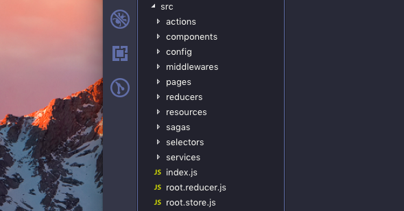

This is a continuation of my previous article - [Architecting React Applications](/articles/architecting-react-applications/) - where I wrote about a simple way to architect almost any React application into a really modular structure. In this article, I am going to write about a relatively complex codebase with things such as application state management, etc. 

We will continue to build upon the same directory structure so that we can also determine whether our previously prepared codebase scales well in more complex scenarios rather than just having a few pages or components. We'll follow the same steps, .i.e, take a look at the directory and then briefly go through the parts one by one.

Now let's add some of redux's *magic* to our application to manage its global state. ✨

But wait, let's get the structure ready first!! So, here we go --

This might seem really familiar to you, and this is adopted by most of the developers out there and is pretty intuitive. All the actions go into a directory called `actions`, reducers in their own directory and same for middlewares. One thing that is not very common here is a `root.reducer` and `root.store` file at the `src`'s root. Now, a lot of developers I have known prefer keeping the `root.reducer` ( sometimes stored as a `index.js` ) inside the `reducers` directory because it is then 'closer' to all the reducers. I agree, it might make a lot of sense to keep it that way, but personally I prefer keeping my `root.reducer` and `root.store` in the root of my `src`. And here's why :

* `reducers` directory is strictly kept for storing individual reducers. The `index.js` inside it is used as a main entry point to export all the reducers. ☝️

* `root.reducer` and `root.store` seem *closer* ( or hooked? ) rather than all the reducers being kept closer to the `root.reducer` -- since `root.reducer` here is being used to configure the reducer before we hook it up with store ( which is done inside `root.store` later ).

So it pretty much makes sense -- to keep all the reducers separately in a place and then just imported through a single entry point to our `root.reducer` which stays close to our `root.store` where it is actually being used. Another simple reason for keeping it there is because it is easier to find when it is in the root of `src` directory rather than inside another nested directory. That is one of the reasons why it is named `root.reducer` and not `index.js`. 

Similarily, our `actions` directory contains all our `actions`, an `action.types` file for all the action types *( we can even have a directory named `shared` in the `src` and put the type file there, I used to do it when I had started using redux )* and a main entry file which exports all the actions. Each file inside our `actions` directory can contain a set of actions that are related to a single aspect of our application, for example, a user, or a user interface state or perhaps some data synchronisation. Same goes for the `middlewares` directory which holds our custom middlewares, if any, and a single entry point which exports all of them.

Note that, all of three new directories added to our previous structure have a main entry point which exports all the individual parts -- mainly because it makes the imports cleaner and also makes it look more modular.

So, we're done with the basic stuff that could be added to any react application which implements an application state ( A little secret -- you can do it without using redux too!  ). 🤓

 

### Let's add some more stuff!!

Let's add more volume to the codebase. First thing that comes to my mind is sagas -- mainly because any real world application with a huge codebase usually has a lot of async stuff going on in parallel and a lot of stuff happening at once. Let's assume we need [redux-saga](https://redux-saga.js.org/) for our application and we can't do away with thunks!

Oh wait, let's have some services too -- for fun! 💥

And while we're at it -- let's not forget about making our state management which we had setup earlier a little better by adding selectors to our application -- which is a must by the way if we have a lot of things going on inside our application store!

Did I add too much? Well.. maybe, but this is just for the purpose of covering all of it ( also, this doesn't imply that your application can not have all of it -- it can pretty much have all of them if and when required ).

Okay, let's follow the same pattern and make the directories first. I'll go ahead and create directories for them, like so :

This might look pretty much self-explanatory and you already have an idea of how we might structure them internally. All our sagas go inside the `sagas` directory, with our root saga also inside it *( you can name it whatever you want -- `root.saga` or `index.js` )* just like our entry points to reducers and actions inside their directories.

But you might ask, why not keep it outside like our `root.reducer` and `root.store`? 🤔

Well, here's a pretty simple explanation. When we discussed about the reducers and actions, we kept the entry point of the directory as something we're directly using in our application -- entry point in `reducers` directory for importing all reducers to `root.reducer` and entry point in `actions` directory for importing them in various parts of our react application. Similarily, for our `root.saga` or `index.js` inside the `sagas` directory, which is going to be used in our `root.store` while initialisation, makes more sense to be seen as a entry / access point and not anything more complex than that. Usually, it'll contain our root saga which will spawn / call / fork / invoke other sagas accordingly.

Same goes for selectors and services. Both contain an entry point which exports all the selectors and service modules from the directory. Keep in mind, it is basically there to provide us a cleaner import and better view of the structure!

And there we go! We have pretty much completed setting up our react application to start off with a complex project -- but with a relatively simple structure which anyone can get used to and something that scales well too! And in my experience, a structure similar to this has fared really well in scaling up along with regular and extensive application wide changes while keeping our productivity high.

 

*Did you like this article? Or did I miss something? Is there something that you have that can be added to this article -- that can make it even better?*

*Please leave a comment below or you can also contact me through my [social media profiles](/).*

*Thank you for reading!* 😄

 

Happy hacking! Cheers! 🎉

