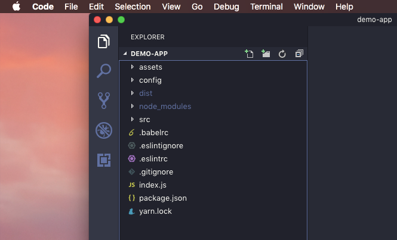
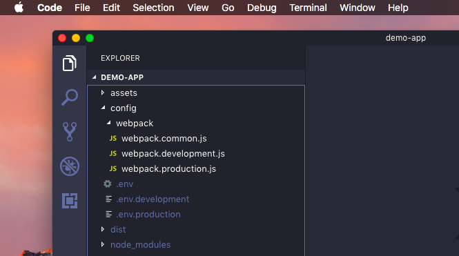

# Architecting React Applications - What I learned from my experience as a Web developer


<br />

React has always been popular for its short learning curve and easy to use APIs. But if you have been working with this popular javascript library for a while now, you might agree with me on this one as well -- If you don't pay attention to it's structure it will soon become an unmaintainable mess. 

Before joining my first job, I had some experience as a freelancer but didn't know much about best practices and architecture apart from what I had come across either online or while development. And even as a freelancer I didn't have experience with such large scale applications that we had to work with later in the job. This is when I started paying more attention to architecture. In the start, things used to get a little confusing sometimes - mostly because I was a bit more conscious about my code than before - which was obvious as I was part of a team now and not a solo freelancer.

So I started looking through GitHub, online articles, papers and books. And as I kept working with React more and more on a large scale I had realised that 

> The key to a robust, scalable and easy to maintain React application is architecture.

This applies to any application or software but with React, abstraction was a bit more difficult than other libraries / frameworks. This was until Hooks were introduced - but we will keep it out of the context for now as it is still fairly new and most of the applications are still built with older versions of React. Also, there are a lot of improvements to be made; lot of do's and dont's to be discovered with its usage. 

As of now, I think the principle that I follow for structuring React applications will work fairly well with Hooks too! Since the focus was on a scalable web application architecture - not just React.

<br/>

Let's quickly take a look at the setup and then I'll walk you through it and try to explain why it is structured that way. So the root of the project looks something like this :



And the `src` directory ( which will contain all the source code for our application, ofcourse ) is structured like this : 


The first thing you might notice, and wonder maybe - and if you don't, I'd recommend taking a look again - that we have two directories named `config` in our project. No, this isn't by mistake! It has a ( extremely ) simple reason. 

<br/>

## Two config directories?! Why though??

The `config` directory at the root contains all the configuration files related to build - like our application's webpack config or any other bundler that we might use, environment files and other configs.



You might also notice that it is nested and that the webpack configuration lives in its own directory. This makes the configurations more organised and easier to manage. This might seem trivial but when the application starts growing , and with that the build process might also get complex - which then demands a well organised place of its own. Also, this brings a peace of mind while working with it -- a large mess of configuration files is the last thing you might want while deploying your application in production!

<br/>

The other `config` directory inside our `src` folder is for configurations related to our application, .i.e, the ones related to runtime. This may contain our json files ( or any other files ) that might shape the behaviour or capabilities of our app. Although, this may or may not be required as per your needs but for me, I have had this folder in most of the projects.

<br/>

## But wait, what about the `resources` and `assets` directories? Aren't assets also a part of the 'resources' for our web application?


Well, the `assets` directory here is meant ***only*** for images and other media *, duhh,*

whereas, `resources` is for data that might be required by our web application, for example, constants and other static data which basically doesn't have any / much logic associated to it. You can also add small methods to return the data, perhaps formatted to specific needs, and / or perform ***minor*** operations on them there which can be used by parts of our application, which by the way -- *trust me* -- will make your code a lot cleaner and more organised.

This directory may also contain data / other 'resources' which can be occasionally fetched and stored / updated and then processed before they are used in certain parts of our web application. Well, I guess you get the idea.

<br />

## And what about our pages and their components?? 

So, here comes the interesting part. Atleast I think so. This is something that has been derived from a few other solutions on architecting react applications as well as other web applications along with some of my own practical experience. And by far, I'm pretty satisfied with it!

To start with, let's assume our web application contains a home page, a profile page for the users and just for the sake of not having just two pages in the example, a third page that we will call -- the other page. So the directory structure would look something like this : 

```jsx
-- src
----- components
----- config
----- pages
--------- home
----------- index.js
----------- index.scss          // Mandatory sass file - I just wanted to make this look realistic!!
--------- profile
----------- index.js
--------- other-page
----------- components
----------- index.js
----- resources

```

Notice how all the pages have their own separate directory with an entry point? And how that 'other' page has a component folder? Why do we need another component folder? Don't we already have a component folder in the root of `src` directory?

Wait, just hold on for a second! I'll explain it real quick!

This is what I call the "branching" structure. Each page has their own directory, their own set of components which are not used anywhere else except in that specific page, their own styles rules and other stuff which are associated with only that page. If any component is shared by two pages, guess where they'd go? Yes, you guessed it right -- the `components` directory in the root of our `src` directory!

But.. you might wonder.. what is the point of doing that?

 Let's say, one day you and your teammates decide to get rid of the 'other' page -- *maybe the name wasn't good enough?* -- so what do you do? Spend an entire afternoon or a day on removing code, breaking and fixing the application? **NO**.
 
 You just go ahead and delete the directory and remove its reference from where it was attached to / used in the web application. *And voila, it's done!*
 
 Nothing breaks in your app just because a bunch of code was deleted! Everything is independent of each other's existence even if they were binded together at some point! A lot less to work with and worry about, isn't it? And yeah, this principle can be applied to almost any application / software and not just some react application.

 Some of you might think -- Well no, our application / software is quite complex and stuff is just too interconnected with each other. They ***shared*** code, were ***bridged*** together, etc. But I guess you might understand now what to do with the "shared code" and "bridges" if you try to apply this principle to it! This is just a simple example to demonstrate and give you an idea of how parts of the product can be organised for convenience and maintainability.

 <br/>

 ## A little tip -- something that I learnt while working with GatsbyJS

 You can also go ahead and add another directory to the `src` -- called `layouts` ( or maybe add it to the `components` directory, whichever feels more appropriate to you ) which contains a layout file which is global to the application, or even have multiple layouts ; each associated with certain parts of the application. For example, let's assume our application also has a fancy navbar and a decent footer which goes into all of our pages. Instead of having them shoved inside our `components` directory and then repeatedly used inside each page - we can have a layout file that contains the navbar and the footer and renders the `children` that are passed to it, like so :

 ```

<Layout>
  <div>
    Yayy! This is my fancy home page!!
  </div>
</Layout>

// And in the profile page :

<Layout>
  <div>
    This is the page of the user whose data we're secretly trying to steal! 
    Please read our privacy policies (not so) carefully!!
  </div>
</Layout>

```

And in our Layout file, we can have something similar to this :


```
const Layout = ({ children }) => (
  <>
    <Navbar />
    {children}
    <Footer />
  </>
);

export default Layout;

 ```

Better now, isn't it? Even this website, with its simplicity, has a layout component!

<br/>

## But wait.. There's more!!

Yes, yes. I haven't forgotten about reducers, the lengthy sagas, the services, a ton of action creators and what not! But that's for the second part of this article since I don't want it to become too long and exhausting to read. Also, this first part might serve as a good starting point for beginners or other fellow developers who are new to React development.

<br/>

*Did you like this article? Or did I miss something? Is there something that you have that can be added to this -- that can make it even better?*

*Please leave a comment below or you can also contact me through my social media profiles listed [here](/).*

*Thank you for reading!*

<br/>

Happy hacking! Cheers!

<hr/>
