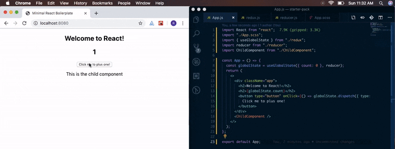
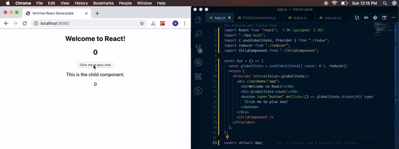
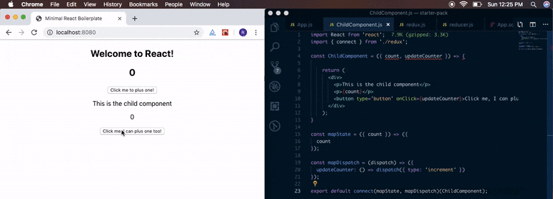

# Managing React application state -- without using Redux!

<br />

***Disclaimer:*** *This solution is best suited for small scale projects and its main motive is to explore the new APIs react provides rather than trying to replace any traditional solutions.*

<br/>

So when was the last time you tried managing application state, without Redux? As far as I can remember, for me, it was probably during the time I had started learning and playing around with React. Although I had known about Redux at the time when I did try not using it, I just wanted to do it because I didn't want to add **three** dependencies to my react application just for managing a really small application state. Ofcourse, when we talk about using redux, we are also going to use `react-redux` and a middleware too!

I basically did it in two different ways ( which most of us, might have tried at some point as well ) :

* Using localStorage and custom listeners.

* Using the Context API.

<br>

**But** in this article, we're not going to discuss that. We're going to see another way of managing the state which is fairly new -- using ***Hooks***.

So, let's setup a react project and add a root component, like so :

`gist:rishichawda/0a35280d00a7320ddc29cb52a1735ab9#App.js`

And our `ChildComponent.js` as,

`gist:rishichawda/de65a5b99d64bdb875dd2b7ae8a40ec4#ChildComponent.js`

First, let us break down the complete flow and decide what we need :

* A state, *ofcourse*

* A way to mutate / update our state.

* A way to sync the data from state to our components wherever required.

* Do all of this while keeping the code clean. ( Very important )

Let's setup our state first. For this, I'm going to use the `useReducer` hook. For those who are not familiar with the `useReducer` hook -- it is similar to the basic `useState` hook but more suited for this case as it provides a dispatch method, the previous state while computing and updating state, etc. Basically, it will provide us a way which is similar to Redux's reducer and action flow. Let's set up our `useGlobalState` hook which will help us initialize our state and provide us a dispatch for updating it as well.

So our `redux.js` looks like this :

`gist:rishichawda/d3ba7b0e4ae70052bf7ce4693fe3822e#redux.js`

So what's going on here? Our custom hook here takes two arguments -- `initialState` for setting an initial state to our app and `reducer` is our reducer function which is going to be used for updating state depending on the actions. 

Our `reducer.js` might look like this : 

`gist:rishichawda/46865557e94f06f3f9dfcf845cfb6b37#reducer.js`

With those two arguments, we can initialise our reducer and state as :

```javascript
const [ state, dispatch ] = React.useReducer(reducer, initialState);
```

Since our `initialState` might, in some cases, require some computation and may not be just a static value -- we are going to use the third argument of `useReducer` to initialise our state from a function just incase we need to. So now we can initialise our state in two ways : 

```javascript
const globalState = useGlobalState(intialState, reducer);
 
 // OR

const globalState = useGlobalState(() => {
  // Do stuff here.
  return state;
}, reducer);
```

But, where do we initialise our state? Well, this needs to be done inside the root component since Hooks can only be called / used inside a functional component. Let's add this to our `App.js` file and use the classic example of making a simple counter.

`gist:rishichawda/853c751bb5c27eee52b0f504c39ac7e2#App.js`

This gives us something like this : 



But still we can't use the state inside our `ChildComponent` since it has no idea of this state. So how are we going to do this?

This is a slightly interesting step now. We're going to use the `createContext` API for that. Let's update our `redux.js` to give us a way to pass the state to our child(ren) component(s), like so :

`gist:rishichawda/73a4ca3292565b3cd96c7b860ad69c85#redux.js`

I guess you can clearly see where this is going. We are going to use the `Provider` component in our root `App.js` and wrap our component with it. Additionally, we'll pass an initial state as the value for our 'provider'. This makes the values available in the DOM tree. But then you might wonder -- we need to wrap all our children who are going to use the state with `context.Consumer`, don't we? Well, no.

Here's were our `React.useContext` hook comes into play along with a little HOC trick. And we're going to name it `connect` so it looks similar to redux! Also, it will be easier to understand if we can visualise it in the 'redux way'. But first, let's check if our current setup works.

Update the `App.js` file to this :

`gist:rishichawda/d72f29069327409c98f37760da1d36f1#App.js`

And our `ChildComponent.js` like this :

`gist:rishichawda/aa53ee31f2e967a2adb4d9c401cddc16#ChildComponent.js`

So what does `useContext` hook do? Well, it's similar to using `context.Consumer` tag which allowed us to access context value and subscribe to its changes. With `useContext` hook, we no longer use the `context.Consumer` in our component. We pass the context object to it, which then returns the value from the current context. Whenever the context data changes, the component is re-rendered with the new values.

Let's see if this works.



Great! But there's one thing. Now we need to call `useContext` in every component! Let's get rid of this. We're going to write a small HOC which exposes an API similar to the `connect` HOC from `react-redux`.

Now, our `redux.js` should look like this :

`gist:rishichawda/c1d8e05b553a518629346d73140f8a75#redux.js`

***Note :*** *As you can see, we are just spreading the props over the component here. The ideal way is to use `hoist-non-react-statics` package to copy all non-react static methods to the new component. Please use that way since it is better than just passing the props. Complete explanation can be found in the [React Documentation for Higher Order Components](https://reactjs.org/docs/higher-order-components.html#static-methods-must-be-copied-over).*

The `connect` HOC here takes our component and uses the context to get all the props that are required by the component as defined in the `mapStateToProps` function in the `connect` call. We can update our `ChildComponent.js` now, to something like this :

`gist:rishichawda/e67e17c52c94505a664a18ccb8005537#ChildComponent.js`

Let's check if this works.



Incase you're wondering, you can have different counters for both of them and it'll work just fine! You just need to initialise the state with both the counters, dispatch actions from their respective buttons and use the respective values from the state to display. Like so :

```jsx
// In App.js, initialise counters like this
const globalState = useGlobalState({ count: 0, anothercount: 1 }, reducer);

/**
 * In ChildComponent.js, update the `mapState` and `mapDispatch` methods
 * to get and update `anothercount` value from state.
 */
const mapState = ({ anothercount }) => ({ // Get the `anothercount` value from state.
  count: anothercount,
});

const mapDispatch = (dispatch) => ({
  // Update the dispatch to trigger `countincrement` action.
  updateCounter: () => dispatch({ type: 'countincrement' })
});

export default connect(mapState, mapDispatch)(ChildComponent);

/** 
 * Finally, update our reducer to handle `countincrement` action,
 * which updates the `anothercount` value in our state.
 */
export default (state, action) => {

  switch (action.type) {
    case 'increment':
      return {
        ...state,
        count: state.count + 1,
      };
      case 'countincrement':
      return {
        ...state,
        anothercount: state.anothercount + 1,
      };
    default:
      return state;
  }
}

```

Oh, and one more thing! Don't forget to wrap your components with `React.memo` if they're **not** connected to state. This will prevent unnecessary re-renders when the state udpates!

And we're done implementing a small redux-like application state management in our react application! All within just 40 lines on code! ✨

You can check out the complete example in [this github repository](https://github.com/rishichawda/globalstate-hook-example). Please leave a star on the repository or comment here if you liked this article!

<br />

*If you have any suggestions or ideas you can also contact me through my [social media profiles](/).*

*Thank you for reading!* 😄

<br/>

Happy hacking! Cheers! 🎉

<hr />
