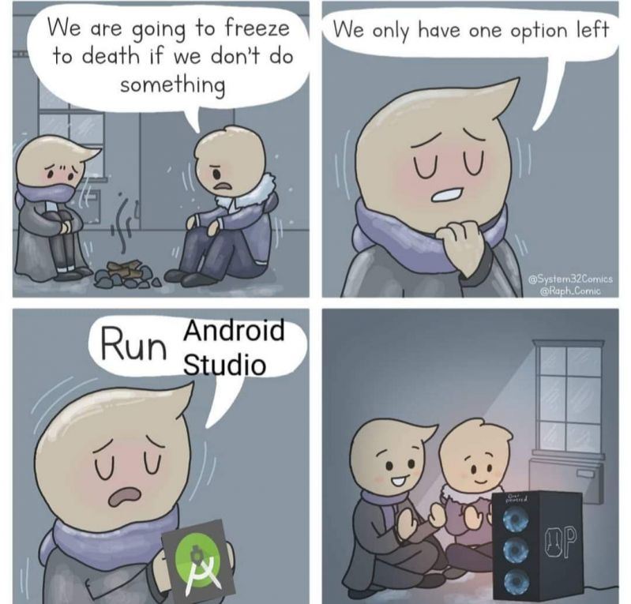
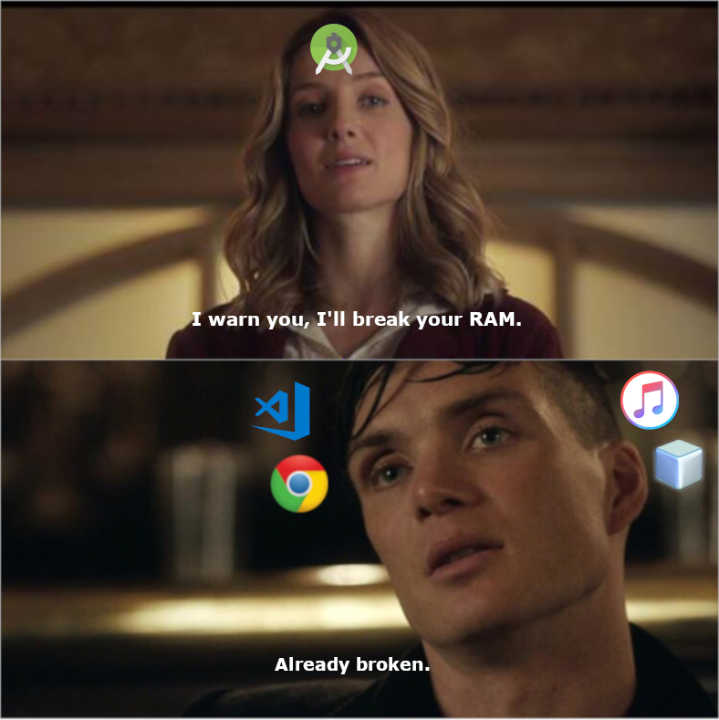

So let me ask you first —

How many of you have installed Android Studio only to use the emulator for your native app? Oh, and don’t forget the way your system struggles when you try to run it!



And no, I’m not just talking about any average system — even my Macbook Pro with 8GB of RAM makes a lot of noise!

A lot of you might have also come across alternatives like Genymotion, Nox, BlueStacks and a lot others. Some are free, while a lot others with really nice features and performance are paid.

So most of us stick to the free ones or end up downloading Android Studio for the really good and easy to use emulator it provides.

But it gets worse when you already have Visual Studio Code , a few tabs on Google Chrome and your music player running!



Also, some of us are just lazy ( and too comfortable with the command line ) that we don't bother installing some fancy GUI application when we can do it with a few commands. 🤓

Okay enough with the memes, let’s quickly set up Android Studio’s emulator for our react native app in a better way this time — without actually installing Android Studio! ✊

<hr />

### Step 1: Install Java Development Kit 8.

First you’ll need to install [JDK 8](https://www.oracle.com/technetwork/java/javase/downloads/jdk8-downloads-2133151.html). Windows and linux users can directly visit the link and download it after accepting the license.
For Mac users, I recommend installing via [Homebrew](https://brew.sh/) :

```bash
brew tap caskroom/versions
brew cask install java8
```

Windows and Linux users should make sure that they have set-up path to their Java installation.

<hr />

### Step 2: Install Android SDK.

Once we have installed and set-up Java in our system, we will need to install Android SDK so that we can get necessary tools in our systems including the android virtual device manager and emulator itself!

Windows and linux users can directly [download the command line tools](https://developer.android.com/studio/#downloads) required for installing the android emulator.

Mac users can install it by running:

```bash
brew cask install android-sdk
```

**Note for Mac users:** If you run into an error like this while installing android SDK :

```bash
Exception in thread "main" java.lang.NoClassDefFoundError: javax/xml/bind/annotation/XmlSchema
at com.android.repository.api.SchemaModule$SchemaModuleVersion.<init>(SchemaModule.java:156)
at com.android.repository.api.SchemaModule.<init>(SchemaModule.java:75)
at com.android.sdklib.repository.AndroidSdkHandler.<clinit>(AndroidSdkHandler.java:81)
at com.android.sdklib.tool.SdkManagerCli.main (SdkManagerCli.java:117)
```

Then you simply need to run the below command and try installing android-sdk again :

```bash
touch ~/.android/repositories.cfg
```

After installing, make sure you have added `android-sdk` to your system path.

For Mac and Linux users, you need to add the following line to your `.bashrc` or `.zshrc` :

```bash
export ANDROID_HOME=/path/to/android-sdk
```

<hr />

#### Important note for the next two steps:

_Incase your system complains about not being able to find the command while trying to issue the next set of commands involving **sdkmanager** , **avdmanager** or **emulator** — you can navigate to the directory where it is present inside the android-sdk folder and run them as **./sdkmanager** , **./avdmanager** and **./emulator** respectively._

_For those of you who are feeling lazy to find it yourself :_

_**sdkmanager** and **avdmanager** will be located inside **android-sdk/tools/bin** whereas **emulator** can be found inside **android-sdk/tools**._

Now that we know this, let’s continue towards a better development experience!

<hr />

### Step 3: Install platform and build tools required for React Native.

Now we can go ahead and set-up platform and build tools to help us in creating and running our virtual device in android emulator. We will use the `sdkmanager` that we just downloaded to our system as a part of `android-sdk`.

To do this, open your terminal and run the following command :

```bash
sdkmanager "platforms;android-23" "build-tools;23.0.1" "add-ons;addon-google_apis-google-23"
```

Once we have downloaded the above packages, run the following command to list all the tools available :

```bash
sdkmanager --list
```

This will fetch the complete list of the available packages on remote that you can download to your system. You can download packages from the list by running :

```bash
sdkmanager "sdk-path-for-package"
```

_**Note:** sdk-path is the string in the leftmost column of the generated list. And it must be wrapped in quotes while running the above command. For example, let’s say we want to create a virtual device which requires **Google APIs Intel x86 Atom System Image** package, we can install the package by running:_

```bash
sdkmanager "system-images;android-23;google_apis;x86"
```

You can download the packages that you need from the list and if you look closely, you’ll find android emulator package there too! But don’t worry I won’t make you go through the long list in your terminal, here’s the command you need to run in order to download the android emulator package :

```bash
sdkmanager "emulator"
```

That’s it! We’ve downloaded the android emulator and we’re ready to set-up our Android virtual device!

<hr />

### Step 4: Create a new virtual device.

Let’s create an android virtual device with the help of **_Google APIs Intel x86 Atom System Image_** we downloaded through the previous command, which was :

```bash
sdkmanager "system-images;android-23;google_apis;x86"
```

Now to create a virtual device, run the following command :

```bash
avdmanager create avd --force --name myTestDevice --abi google_apis/x86 --package 'system-images;android-23;google_apis;x86' --device "myTestDevice"
```

This will create a virtual device named _myTestDevice_ using the _Intel x86 Atom system image_ we downloaded.

To check if your device was created, you can run :

```bash
emulator -list-avds
```

This will list all the virtual devices present in your system.

<hr />

If you followed all the instructions properly, you can see your device listed as well and you must be able to start your virtual device by running :

```bash
emulator -avd myTestDevice
```

And now your android emulator will start with the device you just created! But this time in a better way just like you always deserved — without wasting your precious storage space! 🎉

<br/>

_Did you like this article? Or did I miss something? Is there something that you have that can be added to this article -- that can make it even better?_

_Please leave a comment below or you can also contact me through my [social media profiles](/)._

_Thank you for reading!_ 😄

<br/>

Happy Hacking! Cheers!

<hr />
